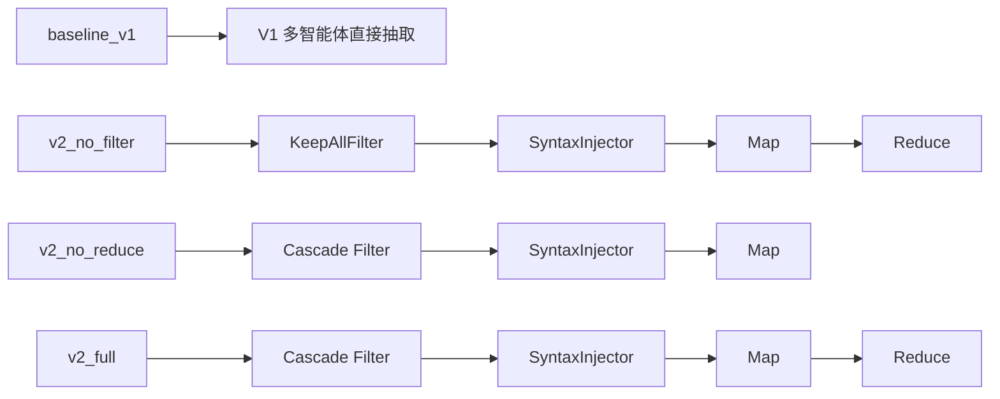

# 项目架构与 Paper1 实验手册

## 1. 宏观系统分层结构图

### 1.1 端到端分层总览

Paper1 当前可执行主链路围绕 `RawDocumentRecord -> CleanedTextChunk -> V2 Map-Reduce -> ExtractionResult -> JSON 报告` 展开。按代码职责可分为 6 层：

1. 原始语料接入层  
   输入：网页正文、TXT/DocRED 文档、附带来源元数据。  
   输出：`RawDocumentRecord`。核心字段包括 `document_id`、`source_type`、`source_uri`、`raw_text`、`created_at`、`metadata`。

2. 标准化清洗层  
   输入：`RawDocumentRecord`。  
   输出：`list[CleanedTextChunk]`。每个 chunk 包含 `chunk_id`、`document_id`、`sequence_no`、`cleaned_text`、`char_start`、`char_end`、`detected_time_expressions`、`metadata`。

3. V2 级联过滤层  
   输入：`list[CleanedTextChunk]` 与目标 `target_schemas`。  
   输出：`list[FilterDecision]`，显式记录 `keep`、`score`、`reason` 与两级过滤审计信息。

4. 句法注入层  
   输入：过滤后保留的 `CleanedTextChunk`。  
   输出：`list[InjectedChunk]`，包含 `original_chunk`、`injected_text`、`hints`、`metadata`。

5. Map-Reduce 关系抽取层  
   输入：`list[InjectedChunk]`。  
   输出：`ExtractionResult`。Map 阶段对单 chunk 并发抽取，Reduce 阶段做实体别名合并、关系去重与 D-S 融合。

6. 实验结果落盘层  
   输入：`ExtractionResult` 与评测指标。  
   输出：标准化 JSON 报告，写入 `backend/data/eval_results/`，文件名形如 `ablation_<mode>_<timestamp>.json` 或批次 `ablation_batch_<timestamp>.json`。

### 1.2 端到端 Mermaid 流程图

```mermaid
flowchart TD
    A[原始语料 / DocRED / TXT / URL] --> B[RawDocumentRecord]
    B --> C[TextCleaningService\nnormalize + denoise + chunk + time detect]
    C --> D[list[CleanedTextChunk]]
    D --> E[Cascade Filter\nStage1 Heuristic\nStage2 Semantic Trigger]
    E -->|keep| F[list[InjectedChunk]]
    E -->|drop| E1[FilterDecision 审计记录]
    F --> G[MapReduceExtractionEngine]
    G --> G1[Map\nasyncio.Semaphore 控制并发]
    G1 --> G2[MultiAgentRelationExtractionService\nPlanner -> Extractor -> Critic -> Judge]
    G2 --> G3[list[PartialGraphResult]]
    G3 --> H[Reduce\n实体去重 + 关系聚合 + D-S 融合]
    H --> I[ExtractionResult]
    I --> J[DocRED 评测\nPrecision / Recall / F1]
    I --> K[JSON 落盘\nbackend/data/eval_results]
```

### 1.3 输入输出格式规范

| 分层 | 输入格式 | 输出格式 | 约束说明 |
| --- | --- | --- | --- |
| 接入层 | 文本/URL/文件 | `RawDocumentRecord` | 必须具备稳定 `document_id` |
| 清洗层 | `RawDocumentRecord` | `list[CleanedTextChunk]` | 保留偏移、时间提示、来源元数据 |
| 过滤层 | `list[CleanedTextChunk]` + `target_schemas` | `list[FilterDecision]` | 不直接丢弃审计信息 |
| 注入层 | `list[CleanedTextChunk]` | `list[InjectedChunk]` | 原文与注入提示并存 |
| Map 层 | `list[InjectedChunk]` | `list[PartialGraphResult]` | 每块独立抽取，允许局部失败 |
| Reduce 层 | `list[PartialGraphResult]` | `ExtractionResult` | 统一返回实体、关系、agent 轨迹、metadata |
| 实验层 | `ExtractionResult` + Gold | JSON 报告 | 保存总体指标与逐文档细节 |

## 2. V2_Pipeline 核心四大模块解析

### 2.1 级联过滤器（Cascade Filter）

#### 当前实现

- 第一层为 `HeuristicFilter`：以最小文本长度、有效字符密度、数字占比、保留关键词为硬规则门控。
- 第二层为 `SemanticTriggerFilter`：使用 `target_schemas` 对应的静态触发词典进行轻量语义筛选。
- 封装器为 `CascadeFilterPipeline`：先执行 Stage 1，再对保留块执行 Stage 2，并保留完整级联审计元数据。

#### 双重门控机制

1. 物理规则硬过滤  
   目标是快速剔除空文本、乱码、表格残片、编号噪声、极短文本块。  
   判据包括：
   - `text_length >= min_text_length`
   - `alpha_numeric_ratio >= min_alpha_numeric_ratio`
   - `digit_ratio <= max_digit_ratio`
   - 命中 `reserved_keywords` 时可直接放宽规则

2. Schema 语义软过滤  
   目标是只让与目标关系族相关的 chunk 进入后续高成本 LLM 抽取。  
   逻辑是以 `target_schemas` 为键，在触发词典中匹配如 `conflict`、`organization`、`person`、`event`、`location` 等词族。

#### 配置方式

- 过滤器硬阈值由 `HeuristicFilter(...)` 构造参数配置。
- Schema 语义门控由 `CascadeFilterPipeline(target_schemas=[...])` 配置。
- 消融时可切换为 `KeepAllFilter()`，完全关闭 Filter 阶段。

#### 触发条件与指标模板

- Stage 1 触发条件：任一 chunk 进入 V2 流水线前必经。
- Stage 2 触发条件：仅对 Stage 1 保留块执行。
- 推荐量化指标：
  - Filter Keep Rate = `kept_chunk_count / chunk_count`
  - Filter Precision Proxy = `命中过 Gold 关系的保留 chunk / 所有保留 chunk`
  - Compute Saving Ratio = `1 - kept_chunk_count / chunk_count`

#### 对 Paper1 的价值

- 过滤层的目标不是直接提升关系分类精度，而是先降低无效 LLM 调用数。
- 在长文档或全量跑批场景中，Filter 能压缩 Map 阶段的 worker 数，从而降低 GPU/服务端请求拥塞风险。
- `v2_no_filter` 与 `v2_full` 的对照可直接衡量过滤层对吞吐率和 F1 的共同影响。

### 2.2 句法注入器（Syntax Injector）

#### 当前实现

- 当前实现是轻量、零外部依赖的结构化提示注入器。
- 注入器不直接做真实依存句法分析，而是构造稳定数据契约：
  - `syntactic_focus`
  - `entity_candidates`
  - `time_hints`
  - `document_id`
  - `chunk_id`
  - `sequence_no`

#### 软性正则提示词构建逻辑

- 专有名词候选通过 `PROPER_NOUN_PATTERN` 提取。
- 书名号、双引号、单引号中的候选名词通过三组正则补充。
- 时间提示直接复用清洗层检测出的 `detected_time_expressions`。
- 最终将“句法先验提示 + 实体先验提示 + 时间提示 + 正文”渲染为统一文本。

#### 作用机制

- 对长文本场景，大模型容易把注意力消耗在低价值上下文上。
- 注入器通过显式提示实体候选和时间锚点，让抽取器更快聚焦主语、宾语、时间修饰与事件线索。
- 在 Paper1 叙事中，可将其解释为“低成本的神经符号先验注入层”，用于缓解长上下文注意力漂移。

#### 提示词模板示例

```text
以下为已清洗文本，请结合结构化先验执行关系抽取：
【句法先验提示】
- 未来接入依存句法树后，将在此提供句法骨架摘要。
【实体先验提示】
- 检测到高价值候选实体：['Barcelona', 'China', 'Summit']，请在抽取时重点关注。
【时间提示】
- 已检测时间表达: ['2025-01-28', '11月19日']
【正文】
<chunk.cleaned_text>
```

#### 预期收益

- 对实体长尾别名、跨句关系和时间锚定场景，预期主要提升 Recall。
- 建议在论文中把注入层收益描述为“对召回率与时间字段规范性的协同提升”，而不是单点精度提升。

### 2.3 Map 阶段（并发抽取）

#### 当前实现

- 核心执行器为 `MapReduceExtractionEngine.map_extract()`。
- 并发控制采用 `asyncio.Semaphore(max_concurrency)`，默认并发上限为 `4`。
- 下游模型客户端为 `QwenClient`，默认模型配置来自 `QWEN_MODEL`，默认值为 `qwen3:8b`。
- 单次 HTTP 请求超时为 `900s`；本轮补充后，单 worker 额外具备 `worker_timeout_seconds=1800s` 的上层超时保护。

#### 当前请求策略

- 并发量控制：客户端侧固定上限并发，避免 chunk 数与请求数线性失控。
- 请求重试：当前代码未实现显式自动重试。
- 负载均衡：当前为单 `QwenClient` 直连单模型入口，没有多实例 LB；Paper1 阶段主要依赖“文档串行、chunk 并发受限”的客户端节流替代复杂调度。

#### 当前吞吐率收益来源

- `baseline_v1`：所有 chunk 汇总后统一抽取，单次长提示，吞吐受长上下文限制明显。
- `v2_*`：按 chunk 切分后并发调度，多 worker 同时执行，吞吐率理论近似受 `max_concurrency` 线性放大，真实收益取决于模型服务端队列与显存。
- 在当前代码下，跨文档没有并发，资源压强主要集中在“单文档内部 chunk 并发”，这有利于在全量跑批时保持服务稳定。

#### 本轮补充的工程保护

- 任一 chunk 超时或异常不再中断整篇文档，只会返回空的 `PartialGraphResult`。
- 这样可以把失败隔离在局部样本级别，防止单条脏样本拖垮整份实验任务。

### 2.4 Reduce 阶段（D-S 融合）

#### 当前实现

- Reduce 核心在 `reduce_aggregate()`。
- 实体聚合键：`normalize_name(entity.canonical_name or entity.surface_form)`。
- 关系聚合键：`(head_entity_id, relation_type, tail_entity_id)` 的归一化三元组。
- 证据合并策略：
  - 合并 `evidence_chunk_ids`
  - 合并 `evidence_texts`
  - 对同键关系执行置信度融合

#### 基于拓扑哈希的消歧逻辑

- “拓扑哈希”在当前实现中体现为关系三元组键的确定性归一化聚合。
- 同一 `(head, relation_type, tail)` 视为同一拓扑位置上的候选边。
- 多个 chunk 产生同构边时，Reduce 将其折叠为单条边，并叠加证据。

#### D-S 证据理论融合公式

设已有关系置信度为 `C1`，新证据置信度为 `C2`，则独立证据融合采用：

`C_new = C1 + C2 - C1 * C2`

其含义是：

- 两条证据都支持同一关系时，联合置信度单调升高。
- 当任一证据置信度接近 1 时，融合结果快速上升但仍不超过 1。
- 该形式简单、稳定、易解释，适合论文中作为“轻量 D-S 融合近似”呈现。

#### 在冲突消解中的作用

- 多 chunk 重复抽取同一关系时，Reduce 能提升真阳性关系的最终置信度。
- 对低质量孤立关系，即便保留，也因缺少重复证据难以在融合后获得优势。
- `v2_no_reduce` 与 `v2_full` 的差异可直接反映融合模块对 Precision 与最终 F1 的贡献。

#### 预期量化收益

- Precision：预期优于 `v2_no_reduce`
- 冲突消解稳定性：预期优于简单拼接模式
- JSON 结果可读性：显著优于未聚合模式，因为重复边数量下降

## 3. 消融实验与评测矩阵（Ablation Matrix）

### 3.1 四种实验模式定义

| 模式 | 业务含义 | 底层路由逻辑 | 启用模块 |
| --- | --- | --- | --- |
| `baseline_v1` | 直接调用多智能体 V1，不走 V2 Filter/Inject/Reduce | `MultiAgentRelationExtractionService.extract()` | Planner / Extractor / Critic / Judge |
| `v2_no_filter` | 启用 Inject + Map + Reduce，但关闭过滤 | `KeepAllFilter + SyntaxInjector + MapReduceExtractionEngine` | Inject / Map / Reduce |
| `v2_no_reduce` | 启用 Filter + Inject + Map，但关闭融合去重 | `CascadeFilterPipeline + SyntaxInjector + NoReduceMapReduceEngine` | Filter / Inject / Map |
| `v2_full` | 启用完整 V2 流水线 | `CascadeFilterPipeline + SyntaxInjector + MapReduceExtractionEngine` | Filter / Inject / Map / Reduce |

### 3.2 消融对照关系



### 3.3 当前实验脚本口径

- 主脚本：`backend/tests/run_ablation_experiments.py`
- smoke 批脚本：`backend/tests/run_ablation_smoke_batch.py`
- 两者环境口径一致：smoke 脚本逐模式调用同一个 `async_main(...)`，默认数据集同为 `data/dev.json`，默认文档数同为 `10`，结果目录同为 `backend/data/eval_results/`。
- 批次拆分策略：模式级串行，文档级串行，chunk 级并发。该设计保守但稳定，适合全量跑批前的资源控压。

### 3.4 评测指标模板

| Mode | Docs | Precision | Recall | F1 | Avg Kept Chunks | Avg Pred Relations | Notes |
| --- | --- | --- | --- | --- | --- | --- | --- |
| `baseline_v1` | TBD | TBD | TBD | TBD | N/A | TBD | V1 直通基线 |
| `v2_no_filter` | TBD | TBD | TBD | TBD | 全保留 | TBD | 衡量 Filter 价值 |
| `v2_no_reduce` | TBD | TBD | TBD | TBD | TBD | TBD | 衡量 Reduce 价值 |
| `v2_full` | TBD | TBD | TBD | TBD | TBD | TBD | 完整 Paper1 模式 |

### 3.5 预期性能趋势

- `baseline_v1`：Recall 可能不低，但长提示与开放关系输出更容易产生噪声。
- `v2_no_filter`：吞吐提升，但仍承担全部 chunk 的 LLM 成本。
- `v2_no_reduce`：召回可能较高，但重复边与冲突边会压低 Precision。
- `v2_full`：应作为 Paper1 主结果模式，目标是在 Precision、资源利用率与结果可解释性之间取得最优平衡。

## 4. 遗留技术债与工程待办

### 4.1 阶段一待办

1. 数据库接入  
   当前 Paper1 全量实验阶段以 JSON 结果落盘为主，不依赖数据库。  
   下一阶段可将 `ExtractionResult` 稳定映射到图数据库和关系数据库，补齐实验审计与可追溯查询。

2. 可视化前端大屏  
   当前前端目录已存在基础壳层，但 Paper1 评测核心仍以后端 JSON 为主。  
   阶段一建议构建：
   - 实验指标面板
   - 文档级关系对照面板
   - Mermaid / 图谱预览面板

### 4.2 V3 时序演化模块

- 对应目录：`backend/app/v3_temporal_pipeline/`
- 当前定位：未来版本的时序关系演化分析模块
- 规划能力：
  - 时间衰减建模
  - 关系演化轨迹建模
  - 时间窗口级聚合与预测
- 预留接口方案：
  - 继续复用 `CleanedTextChunk`
  - 继续复用 `ExtractionResult`
  - 在 Reduce 后追加时间演化建模器

### 4.3 V4 超图建模模块

- 对应目录：`backend/app/v4_hypergraph_pipeline/`
- 当前定位：未来版本的超图关系网络建模模块
- 规划能力：
  - 事件中心超边抽取
  - 多实体高阶互动建模
  - 关联矩阵 / 超图投影
- 预留接口方案：
  - 从当前二元关系 `TemporalRelation` 兼容扩展到高阶参与者集合
  - 保留与 V2/V3 相同的 chunk 输入与并发编排入口

### 4.4 时间节点建议

| 阶段 | 时间窗口 | 目标 |
| --- | --- | --- |
| P1 全量实验期 | 当前 | 固化 V2 主链路、完成消融与主结果表 |
| 工程增强期 | P1 结果稳定后 1-2 周 | 补数据库落盘与实验可视化 |
| V3 研究期 | 工程增强后 2-4 周 | 引入时序演化建模与时间衰减分析 |
| V4 研究期 | V3 稳定后 | 引入超图关系网络与高阶事件建模 |

### 4.5 Paper1 执行建议

- 以 `v2_full` 作为主实验模式。
- 全量跑批前先执行 smoke batch，确认模型可用、环境变量完整、结果目录可写。
- 全量阶段保持“模式串行、文档串行、chunk 并发”的保守调度，不建议一次性叠加跨文档并发。
- 论文撰写时明确区分“当前已实现能力”与“V3/V4 预研规划”，避免叙述越界。
